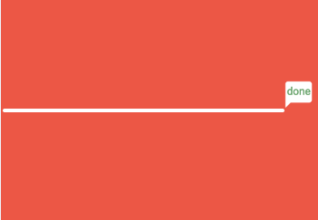
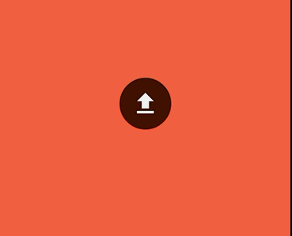
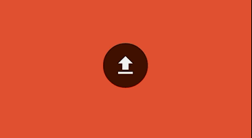

#SpecialProgressBar
>A Special Progress Bar for Android

>创意来自[**Dribbble**](https://dribbble.com)

#Preview




---
###Usage xml
```
  <com.mrzk.specialprolibrary.SpecialProgressBarView
        android:id="@+id/ls"
        android:layout_width="match_parent"
        android:layout_height="wrap_content"
        android:layout_centerInParent="true"
        app:startDrawable="@drawable/ic_file_upload_white_36dp"
        app:endSuccessDrawable="@drawable/ic_done_white_36dp"
        app:textSize="12sp"
        app:textColorSuccess="#66A269"
        app:textColorNormal="#491C14"
        app:textColorError="#BC5246"
        app:progressBarHeight="4dp"
        app:progressBarBgColor="#491C14"
        app:progressBarColor="#ffffff"
        app:canReBackable="true"
        app:canDragable="false"
        />
```
###java

```
            ls = (SpecialProgressBarView) findViewById(R.id.ls);
            ls.setEndSuccessBackgroundColor(Color.parseColor("#66A269"))//设置进度完成时背景颜色
            .setEndSuccessDrawable(R.drawable.ic_done_white_36dp,null)//设置进度完成时背景图片
            .setCanEndSuccessClickable(false)//设置进度完成后是否可以再次点击开始
            .setProgressBarColor(Color.WHITE)//进度条颜色
            .setCanDragChangeProgress(false)//是否进度条是否可以拖拽
            .setCanReBack(true)//是否在进度成功后返回初始状态
            .setProgressBarBgColor(Color.parseColor("#491C14"))//进度条背景颜色
            .setProgressBarHeight(ls.dip2px(this,4))//进度条宽度
            .setTextSize(TypedValue.applyDimension(TypedValue.COMPLEX_UNIT_SP, 12, getResources().getDisplayMetrics()))//设置字体大小
            .setStartDrawable(R.drawable.ic_file_upload_white_36dp,null)//设置开始时背景图片
            .setTextColorSuccess(Color.parseColor("#66A269"))//设置成功时字体颜色
            .setTextColorNormal(Color.parseColor("#491C14"))//设置默认字体颜色
            .setTextColorError(Color.parseColor("#BC5246"));//设置错误时字体颜色

            ls.beginStarting();//启动开始开始动画
            ls.setError();//进度失败 发生错误

   ls.setOnAnimationEndListener(new SpecialProgressBarView.AnimationEndListener() {
            @Override
            public void onAnimationEnd() {
                ls.setMax(187);
                ls.setProgress(num);//初次进入在动画结束时设置进度
            }
        });
        ls.setOntextChangeListener(new SpecialProgressBarView.OntextChangeListener() {
            @Override
            public String onProgressTextChange(SpecialProgressBarView specialProgressBarView, int max, int progress) {
                return progress * 100 / max + "%";
            }

            @Override
            public String onErrorTextChange(SpecialProgressBarView specialProgressBarView, int max, int progress) {
                return "error";
            }

            @Override
            public String onSuccessTextChange(SpecialProgressBarView specialProgressBarView, int max, int progress) {
                return "done";
            }
        });
``` 

###About me
---
An Android Developer in ZhengZhou.

【[**我的简书地址**](http://www.jianshu.com/users/3c751e06dc32/latest_articles)】

【[**我的CSDN地址**](http://blog.csdn.net/zhangke3016)】

---
###License
=======
Copyright  2016  zhangke

Licensed under the Apache License, Version 2.0 (the "License");
you may not use this file except in compliance with the License.
You may obtain a copy of the License at 
http://www.apache.org/licenses/LICENSE-2.0
Unless required by applicable law or agreed to in writing, software
distributed under the License is distributed on an "AS IS" BASIS,
WITHOUT WARRANTIES OR CONDITIONS OF ANY KIND, either express or implied.
See the License for the specific language governing permissions and
limitations under the License.
